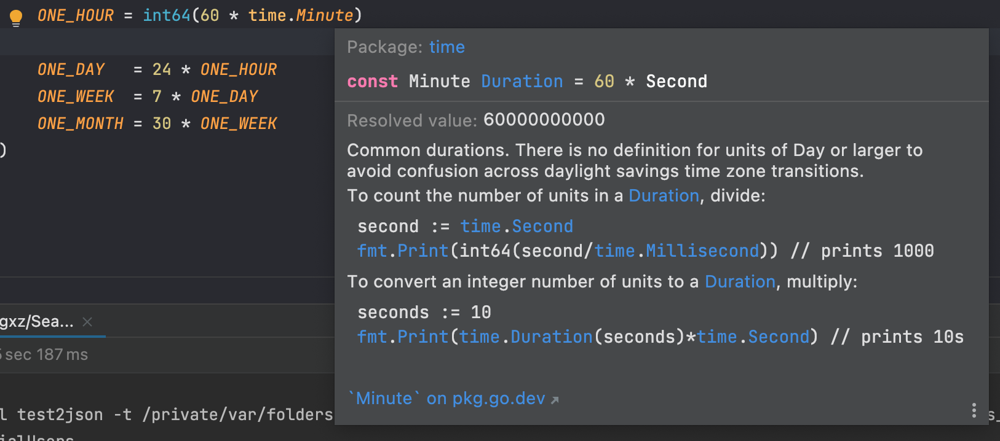

## Introduction
What the hell am I talking about? You might say. Well yea it sounded crazy but **how long is a second** exactly?!

## What Happened
As I was writing some unit tests for my shiny Redis Set implementation, somethign weird caught my attention.
```
TestSendPotentialUsers | Successful | Written 80687641:-18230398344540846 to potential_user set
```
# *Excuse me?*

<!--truncate-->


For context, the Redis key was constructed using:
```go
toWrite := fmt.Sprint(u, ":", time.Now().Unix()-common.ONE_MONTH-common.ONE_DAY)
```

After some digging around, I realised that in my `common.ONE_HOUR`:


Why didn't I think of that, it is in milliseconds!
And my `common.ONE_MONTH-common.ONE_DAY` will effectively become 18144000000000000 - 6048000000000000 🤣

One quick fix is:
```go
	ONE_HOUR  = int64(60*time.Minute) / int64(1*time.Second)
```
And noice, it finally makese sense now.
```
TestSendPotentialUsers | Successful | Written 93737927:1637229666 to potential_user set
```