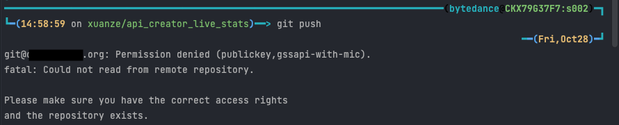

## Introduction
Mac OSX 13 Ventura is finally released and available for update. But did it mess things up..?

## What Happened
After updating, everything seems perfect, and to be honest there aren't any noticable changes to the overall experience.
No news is good news. However, the first abnormality appears when I wanted to push some stuff.



Hmmm... nothing was changed tho...

<!--truncate-->

This looks okay.
```
$ eval $(ssh-agent -s)
> Agent pid 4644
```

Adding the rsa key to the SSH agent didn't help either.
```
$ ssh-add ~/.ssh/id_rsa
> Identity added: /Users/myname/.ssh/id_rsa (xuanze.ang@domain.com)
```

Running a verbose log:
```
$ ssh -vT git@domain.org

debug1: Authentications that can continue: publickey,gssapi-with-mic
debug1: Next authentication method: gssapi-with-mic
debug1:  Miscellaneous failure (see text)
no credential for XXX-XXX


debug1:  An invalid name was supplied
unknown mech-code 0 for mech 1 2 752 43 14 2


debug1:  Miscellaneous failure (see text)
unknown mech-code 0 for mech 1 3 6 1 5 5 14


debug1:  Miscellaneous failure (see text)
unknown mech-code 2 for mech 1 3 6 1 4 1 311 2 2 10


debug1:  An unsupported mechanism was requested
unknown mech-code 0 for mech 1 3 5 1 5 2 7


debug1:  Miscellaneous failure (see text)
unknown mech-code 0 for mech 1 3 6 1 5 2 5

...

debug1: Authentications that can continue: publickey,gssapi-with-mic
debug1: Trying private key: /Users/myname/.ssh/id_ed25519_sk
debug1: Trying private key: /Users/myname/.ssh/id_xmss
debug1: Trying private key: /Users/myname/.ssh/id_dsa
debug1: No more authentication methods to try.
git@domain.org: Permission denied (publickey,gssapi-with-mic).
```

[This question on superuser](https://superuser.com/questions/1749364/git-ssh-permission-denied-in-macos-13-ventura) seems to be EXACTLY what I was looking for.

> This release disables RSA signatures using the SHA-1 hash algorithm by default. This change has been made as the SHA-1 hash algorithm is cryptographically broken, and it is possible to create chosen-prefix hash collisions for <USD$50K [1]

However, the top answer suggested re-generating a SSH key, which is lame.

But the [Reddit thread](https://www.reddit.com/r/MacOSBeta/comments/v8jt42/comment/ijqnlzj/) mentioned in the answer tho.. turned out to be the solution!


## How to fix

1. Edit ssh_config
```
sudo nano -w /etc/ssh/ssh_config
```

2. Add HostKeyAlgorithms +ssh-rsa,ssh-dss and PubkeyAcceptedAlgorithms +ssh-rsa at the bottom under Host *
```
Host *
    SendEnv LANG LC_*
    + HostKeyAlgorithms +ssh-rsa,ssh-dss
    + PubkeyAcceptedAlgorithms +ssh-rsa
```

3. Done!